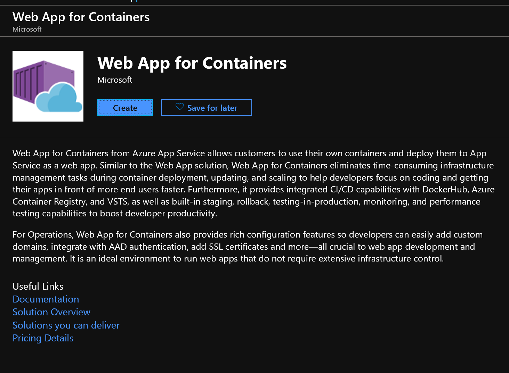

<p style="text-align: center;"> **Deploy Dockerized Angular Application to Azure ** </p>


Introduction
============

Your organization running angular web application to help their customers. The entire setup is running on their premises. Company
business is growing hence facing various challenges like

-   **High Availability: -** To make sure service up and running all the time. Unavailability of service impact customer experience and
    business continuity

-   **Increase in Infrastructure Cost: -** Always demand to buy new hardware to keep satisfying the growth. 

-   **Fault Tolerance: -** Make sure service is up and running even if some of the service is not functioning properly

-   **Scalability: -** Auto scale based on the network traffic.

-   **Security: -** Keep infrastructure and services secure

-   **Latency: -** How to reduce latency in the application

-   **Global reach: -** Ability to reach global audience

And so on...

The organization appoints you to overcome all the challenges. You suggested to move entire application to Azure so that organization can
focus on their business. In this hands on lab we'll see how you can move customer existing Angular based application as it is (or with minimum changes) to Azure.

Prerequisite
============

-   VS Code 2017

-   Docker

-   Azure Subscription

Architecture
============


LAB
===

In step 1 we'll setup Azure virtual machine on Azure and install VS code
and Docker hub there. Step 2 involves develop, dockerized image and
deploy image to Docker Hub. Step 3 we'll setup WebApp for containers,
pull image from docker and test the sample app.

Step 1: - Setup Azure VM, Install VS Code and Docker hub
--------------------------------------------------------

-   Login to <https://ms.portal.azure.com>

-   Click **Create a resource** and search for Windows Client

> 

-   Click **Windows Client**

-   Click **Create**

    

-   On next screen, select **Subscription** (choose the one you got it
    during the workshop)

-   Click **Create new** Resource group. Give a name and click OK

-   Provide **Virtual machine name**

-   Select **Region** which is near to your location

-   Keep default value for Availability options, Image and size

-   Provide Username, Password and Confirm Password. Keep a note of it
    as it will be used for RDP

-   Select **Allow selected ports** as **Public Inbound ports**

-   Select RDP as **Select inbound ports**

    

-   Click **Next: Disks \>**

-   Select **Standard HDD** as **OS disk type**

    

-   Click **Review + Create**

-   Click **Create** once **Validation passed**

-   Once deployment is successful, click on **Go to resource**

    

-   Click **Connect**

    
    
-   Click **Download RDP File**

    

-   Save the RDP connection

    

-   Once saved, open the RDP connection file

    
    
-   Click **Connect** and log into the VM

-   Once logged in to the VM, open a browser and go to
    <https://code.visualstudio.com/download>


-   Click **User Installer** 64 bit and install VS code

-   Once VS code installation is complete, switch to browser and go to
    <https://docs.docker.com/v17.09/docker-for-windows/install/#download-docker-for-windows>
    to install docker on windows

-   Click **Get Docker for Windows (Stable)**

    

-   Install docker for windows. On the last step, keep default option
    selected and click **Ok**

    

-   Once installation is done, click **Close and log out**

    

-   Once login back in the VM, you will notice Docker for windows is
    getting started

    

-   Docker requires Hyper-V to be enable in VM. If you get below
    message, please click **Ok.** It will take some time

    

-   RDP again to Virtual machine

-   Once docker is up and running, it will prompt below message

    
    
-   If you haven't have any docker account then create one at
    hub.docker.com. That account you will use to deploy your Angular
    image at docker hub (kind of repository for all your images).

-   Once you logged in, Right click on docker icon at system tray

    

-   Make sure you successfully logged in and it's running linux
    container and not windows.

-   Install Node.js runtime from <https://nodejs.org/en/download/>

-   Search for "Visual studio code", right click and run it as
    Administrator

> 

-   Once Visual Studio Code opens click **Extensions** on left side
    panel

-   Click on **Extensions** and search for Docker

    

-   Click **Install**

-   Once installation is done, the screen will look like below

    

-   Close and open Visual studio again (as run as administrator).

-   You were successfully able to setup VS code and docker

Step 2: - Develop, Dockerized image and deploy

-   On Visual Studio Code user interface, click **Terminal** and select
    **New Terminal**

    
    
-   If framework opens up PowerShell terminal then you can switch to
    command prompt. Click on **Customize** option for the prompt

    

-   Select **Command Prompt**

    

-   Once terminal opens, you can switch to c:\\ (if by default it's not
    there)

    
    
-   Type **npm install -g \@angular/cli** and press Enter


-   Type **ng new my-app** and press Enter. Select y for "**Would like
    to add Angular routing**" and press Enter for CSS (which default)
    for "**Which stylesheet format would like to use?**"

    

-   Once process is done, it will add a new folder called **my-app** in
    the same folder. From left menu bar, click **Open Folder**

    
    
-   Select the **my-app** folder from the path

    

-   Click **Select Folder**

-   Open ./src/app/app.component.ts.

-   Change the title property from \'my-app\' to \' \"Deploy Dockerized
    Angular Application to Azure\" Lab!!! \'.

    

-   Let's compile and run the application

-   In terminal window, type **ng serve** and press **Enter**

    

-   Open a browser and type http://localhost:4200

> 

-   Switch to terminal and click CTRL+C to stop Angular runtime

-   Click **New File** icon, beside **My-App** folder

    

-   Provide file name as **Dockerfile**

    
    
-   Copy and paste below code in **Dockerfile**

    ```FROM node:11.6.0-alpine AS nalpineimage
       COPY . ./MY-APP
       WORKDIR /MY-APP
       RUN npm i
       RUN $(npm bin)/ng build --prod

       FROM nginx:1.15.8-alpine
       COPY --from=nalpineimage /MY-APP/dist/my-app/ /usr/share/nginx/html
    ```

-   Save the file

-   Let's build the app. Type **ng build \--prod**

    

-   Once done. Let's build docker image

-   Right click on Dockerfile and click **Build Image**

    
    
-   Change the tag if you want and click **Enter**

    
    
-   The command will start building image. Wait for sometime while it's
    building the image.

    

-   Let's check if docker image is created or not

-   Type **docker images** and press **Enter**

    

-   To run docker image, type **docker run -d -p 3000:80 \--rm
    my-app:latest**

    

-   Type **docker container ls -a** and press
    **Enter**

-   Open a browser, type **<http://localhost:3000/>** and press Enter

    

-   To stop docker container, type **docker stop \<CONTAINER ID\>**

    

-   Run **docker container ls -a** to check if container is stop or
    not**.** It will show no record which means no container is running.

-   Switch to browser and refresh the page or type
    <http://localhost:3000>. Since no container is running hence you see
    **"Can't reach the page"**

    
    
-   Let's deploy docker image to docker hub

-   Let's login to docker hub. Type **docker login**

    

-   Since you are already login in docker hub, it checks against
    existing login.

-   First tag the image. Type **docker tag 'IMAGE ID'
    'DOCKER\_HUB\_NAME/IMAGE\_NAME:TAG\_NAME'**

    

-   Push the image, Type docker push
    **'DOCKER\_HUB\_NAME/IMAGE\_NAME:TAG\_NAME'**

> 

-   Open a browser, type hub.docker.com. Once login, see all the
    repository

    

-   Great! You deployed your docker image to docker hub.

Step 3:- Setup Azure Web App for containers and Access the website

-   Open browser and type <https://portal.azure.com> . Login with the
    credential which is used to setup the subscription

-   Click **Create a resource,** type web and click **Web App for
    Containers **

    
    
-   Click **Create**

    

-   Type **App name**, select **Subscription**, create or select
    **Resource group**, select **Linux** as **OS**

    

-   Click **Configure container**

-   Click **Docker Hub** as **Image source**

-   Select **Public** as **Repository Access**

-   Provide Image and tag name

    

-   Click **Apply**

-   Click **Create**

-   Wait while Azure makes your application deployed and configured.

-   Check notification option to check the status

    
    
-   **Pin to dashboard** if you like and open the tile else **go to
    resource**

    
    
-   On the overview page, copy **URL**

    
    
-   Open the browser and paste the url in address bar, press **Enter**

    

-   Hurray!!! You successfully able to Deploy Dockerized Angular
    Application to Azure.

Cleanup
=======

-   Please delete all the resources from the Azure portal to avoid any
    charges to your subscription
